# UML Activity Diagram for the Budget Tracker: Track an Allowance

```mermaid
flowchart TD
  Start((" ")) --> A1["Set allowance amount and period type"]
  A1 --> Y1["Save allowance period as ACTIVE"]
  Y1 --> A2["Enter purchase amount and note, tap Save"]
  A2 --> D1{"Input valid?"}
  D1 -->|"[invalid]"| A3["Correct the entry"]
  A3 --> A2
  D1 -->|"[valid]"| D2{"Active period exists?"}
  D2 -->|"[no]"| A1
  D2 -->|"[yes]"| Y3["Save purchase and recalculate remaining balance"]
  Y3 --> D3{"Spending ahead of pace?"}
  D3 -->|"[ahead of pace]"| Y4["Save pace alert as UNREAD"]
  D3 -->|"[on pace]"| Y5["Show updated balance"]
  Y4 --> A4["See updated balance and alert"]
  Y5 --> A4
  A4 --> D4{"Log another purchase?"}
  D4 -->|"[yes]"| A2
  D4 -->|"[no]"| End(((" ")))

  classDef student fill:#dbeafe,stroke:#2563eb,color:#000
  classDef system fill:#fef9c3,stroke:#ca8a04,color:#000
  class A1,A2,A3,A4 student
  class Y1,Y3,Y4,Y5 system
  style Start fill:#000,stroke:#000
  style End fill:#000,stroke:#000
```

## Key

| Notation | Meaning |
|---|---|
| Blue rectangle | An action done by the Student |
| Yellow rectangle | An action done by the System |
| Filled circle | Start of the activity |
| Double circle | End of the activity |
| Diamond | A decision; every outgoing arrow has a guard in [brackets] |

## Notes

- **Audience / risk:** product owner and developers; it reduces the risk of building steps in the wrong order or missing a branch.
- This is the core workflow the MVP is built on: log a purchase fast, see what is left, get warned when ahead of pace.
- The "no active period" guard matches the 409 response in `sequence.md`.
- The pace alert is saved and shown in the same response. There is no external notification service in the MVP.
