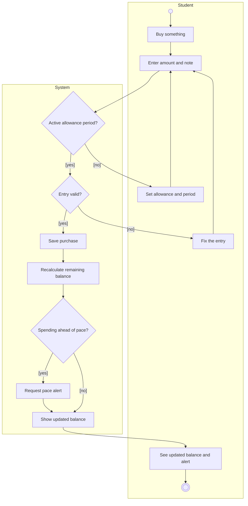

# UML Activity Diagram for the Budget Tracker: Logging a Purchase

## Key

| Notation | Meaning |
|---|---|
| Small circle | Start of the activity |
| Double circle | End of the activity |
| Rectangle | An action, named with a verb |
| Diamond | A decision; every outgoing arrow has a guard in [brackets] |
| Large frame (lane) | Who is responsible for the actions inside it |

## Notes

- Mermaid has no dedicated activity diagram type, so this flowchart approximates UML notation.
- This is the core workflow because logging purchases is what the Budget Tracker exists to support.
- The pace alert itself is delivered later by the external Notification Service, shown as an asynchronous message in the sequence diagram.
- Use cases realized here: Set allowance and period, Log purchase, View remaining balance, Receive pace alert.
