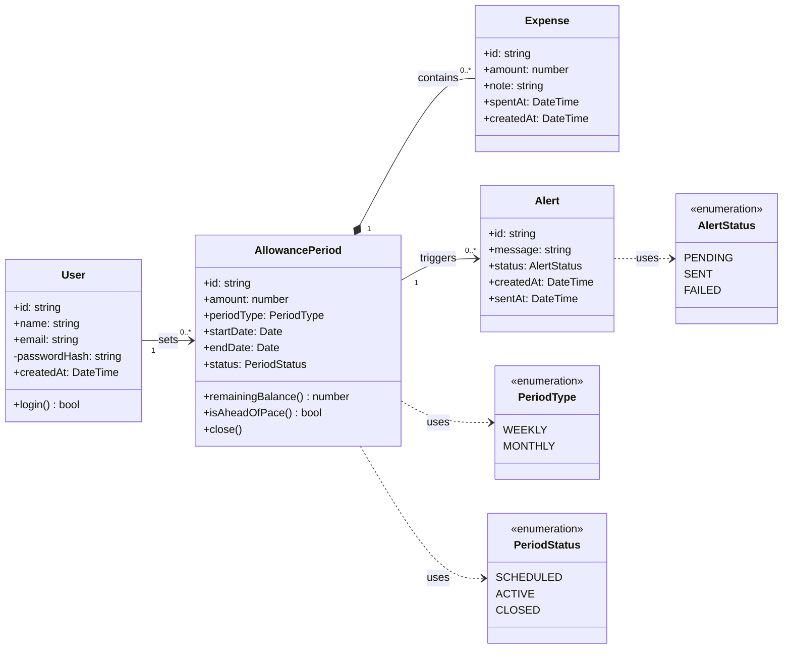

# UML Class Diagram for the Budget Tracker Domain

## Key

| Notation | Meaning |
|---|---|
| Box with three parts | Class: name, attributes, operations |
| Solid arrow with label | Association, with multiplicity at both ends |
| Filled diamond | Composition: an Expense cannot exist without its AllowancePeriod |
| Dashed arrow | A class uses an enumeration |
| «enumeration» | A fixed list of allowed values |

## Notes

- `PeriodStatus` values match the state machine in `state-machine.md`.
- `createdAt` on every logged purchase supports the activation, retention and under-5-seconds metrics from the Lean Canvas.
- `passwordHash` is private and never leaves the server.
