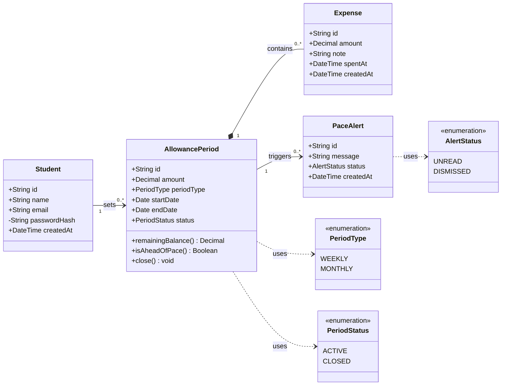

# UML Class Diagram for the Budget Tracker Domain

## Key

| Notation | Meaning |
|---|---|
| Box with three parts | Class: name, attributes, operations |
| Solid arrow with label | Association, with multiplicity at both ends |
| Filled diamond | Composition: an Expense cannot exist without its AllowancePeriod |
| Dashed arrow | A class uses an enumeration |
| «enumeration» | A fixed list of allowed values |

## Notes

- **Audience / risk:** developers; it reduces the risk of a wrong data model.
- Classes come from the nouns in the MVP: student, allowance, purchase, balance and alert.
- `PeriodType` WEEKLY and MONTHLY come from "weekly/monthly allowance". There are no categories, matching "no complex categories".
- `PeriodStatus` values match `state-machine.md` exactly.
- Remaining balance is calculated (`remainingBalance()`), not stored.
- `PaceAlert` is stored so alerts can be shown in the app and marked as read. Team decision: confirm this is wanted.
- `passwordHash` is private and never leaves the server.
