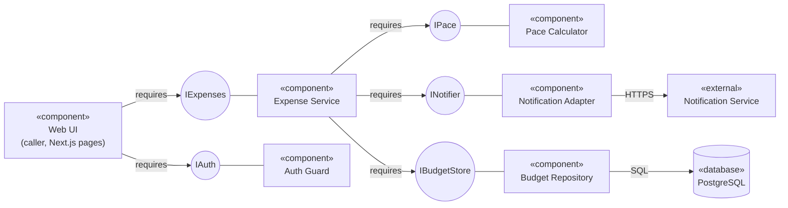

# UML Component Diagram for the Budget Tracker API Application

## Key

| Notation | Meaning |
|---|---|
| «component» box | A replaceable part with a clear responsibility |
| Circle | An interface (a service offered or needed) |
| Line from a circle to a component | The component provides that interface |
| "requires" arrow | The component needs that interface |
| «external» | A system we do not build or control |

## Notes

- Expense Service depends on the `INotifier` interface, not on a specific provider. Changing the notification provider changes only the Notification Adapter.
- Budget Repository is the only component that runs SQL.
- Auth Guard checks the session before any expense logic runs.
