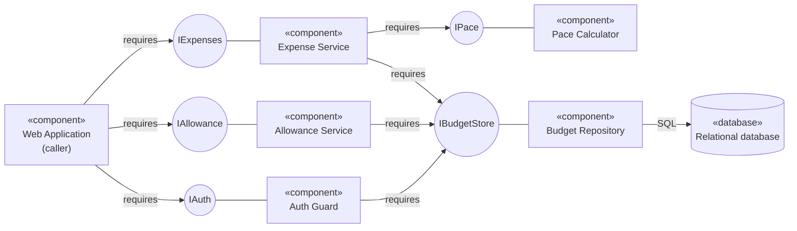

# UML Component Diagram for the Budget Tracker API Application

## Key

| Notation | Meaning |
|---|---|
| «component» box | A replaceable part with a clear responsibility |
| Circle | An interface (a service offered or needed) |
| Line from a circle to a component | The component provides that interface |
| "requires" arrow | The component needs that interface |

## Notes

- **Audience / risk:** developers; it reduces the risk of tight coupling between logic and storage.
- Budget Repository is the only component that runs SQL.
- Auth Guard checks the session before any expense or allowance logic runs.
- The MVP has no external services (no bank linking, no payments). If one is added later, it goes behind its own adapter interface.
