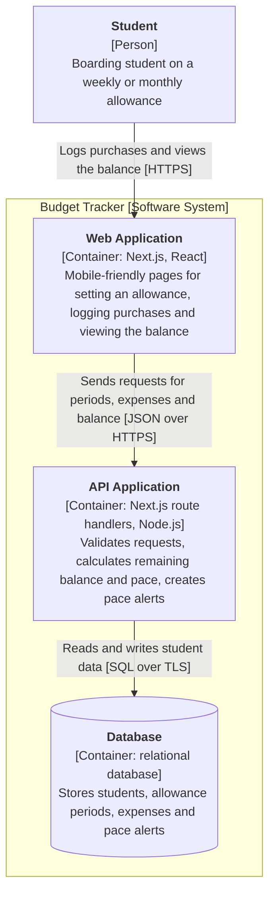

# C4 Container Diagram for the Budget Tracker

**Next.js decision:** we drew the Next.js app as two containers, a Web Application (pages that run in the student's browser) and an API Application (route handlers on the server), even though both are built and deployed together as one Next.js project.

## Key

| Notation | Meaning |
|---|---|
| Rectangle [Container] | A separately running unit, with its technology |
| Cylinder | A database container |
| Frame | The system boundary |
| Arrow with label | Intent of the call, and the protocol in square brackets |

## Notes

- **Audience / risk:** developers and the instructor; it reduces the risk of unclear technology and responsibility boundaries.
- The Web Application never talks to the Database directly.
- The database provider is not chosen yet (see `deployment.md`).
