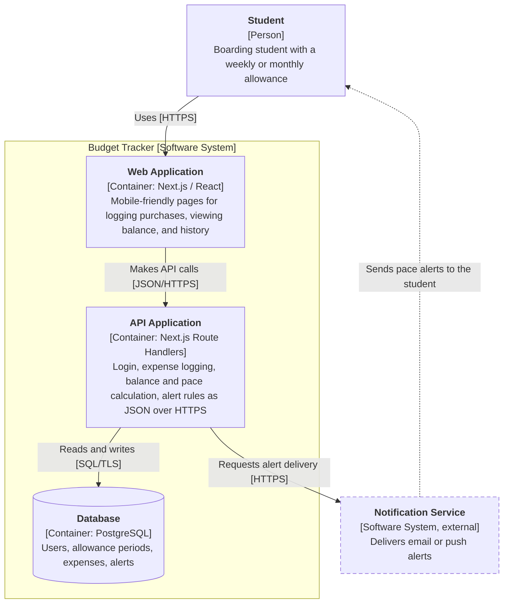

# C4 Container Diagram for the Budget Tracker

## Key

| Notation | Meaning |
|---|---|
| Solid-bordered box | Element inside the scope being described |
| Dashed-bordered box | External software system we do not build or control |
| Large labelled frame | Boundary of the software system being zoomed into |
| Cylinder | Container that stores data |
| Solid arrow | Request or call, labelled with intent [technology] |
| Dashed arrow | Asynchronous message (an alert delivered later) |

## Containers

| Container | Technology | Responsibility |
|---|---|---|
| Web Application | Next.js / React | Pages for logging purchases, viewing balance and history |
| API Application | Next.js Route Handlers | Authentication, expense logging, balance and pace calculation, alert rules |
| Database | PostgreSQL | Stores users, allowance periods, expenses, alerts |

## Design note

We drew the Next.js app as **two containers** (web and API) because they have different responsibilities and callers.
