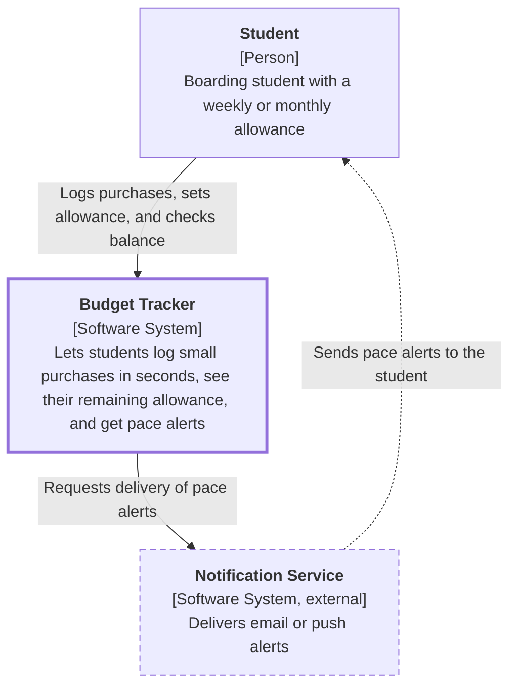

# C4 System Context Diagram for the Budget Tracker

## Key

| Notation | Meaning |
|---|---|
| Thick-bordered box | The software system in focus |
| Dashed-bordered box | External software system we do not build or control |
| Solid arrow | Request or call, labelled with intent |
| Dashed arrow | Asynchronous message (an alert delivered later) |

## Narrative

The Student is the only user role. The Student logs purchases, sets an allowance, and checks the remaining balance in the Budget Tracker. When spending runs ahead of pace, the Budget Tracker asks an external Notification Service to deliver an alert. The system has no bank or e-wallet integration by design.
