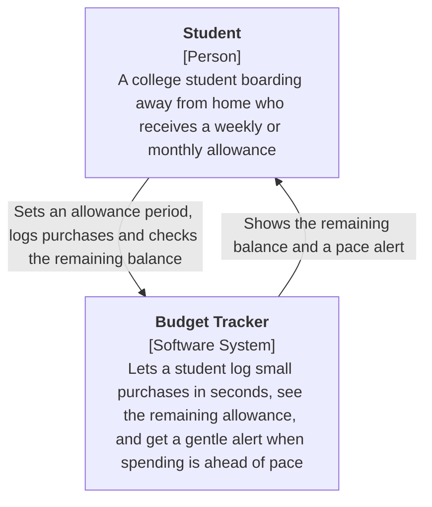

# C4 System Context Diagram for the Budget Tracker

## Key

| Notation | Meaning |
|---|---|
| Box marked [Person] | A user role |
| Box marked [Software System] | The system we are building, drawn as one box |
| Arrow with label | A relationship, labelled with what the sender is trying to do |

## Notes

- **Audience / risk:** shared by the team, the instructor and non-technical readers; it reduces the risk of building the wrong scope.
- The only user role is the Student. Boarding house owners and campus orgs on the Lean Canvas are marketing channels, not users of the system.
- There are no external systems in the MVP. The Lean Canvas excludes bank linking, and payments (the paid tier) are not part of the MVP.
- Source: Lean Canvas (Customer Segments, Solution) and Javelin board, Experiment 1.
