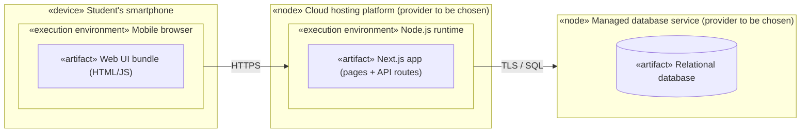

# UML Deployment Diagram for the Budget Tracker (Provisional)

## Key

| Notation | Meaning |
|---|---|
| «device» / «node» | A machine or service where software runs |
| «execution environment» | Software that runs artifacts (browser, runtime) |
| «artifact» | A deployable file or unit |
| Solid line | Communication path, labelled with its protocol |

## Notes

- **Audience / risk:** the team and whoever deploys; it reduces the risk of surprises in hosting and cost. Provisional: provider names are generic until chosen.
- The Web Application and API Application from `containers.md` ship together as one Next.js artifact. The Database runs on the managed database node.
- The student needs only a phone browser; no app install, no bank linking.
- No secrets or real addresses appear in this diagram.
