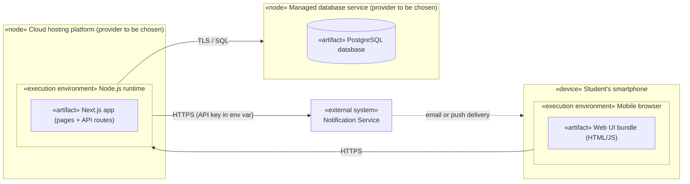

# UML Deployment Diagram for the Budget Tracker (Provisional)

## Key

| Notation | Meaning |
|---|---|
| «device» / «node» | A machine or service where software runs |
| «execution environment» | Software that runs artifacts (browser, runtime) |
| «artifact» | A deployable file or unit |
| Solid line | Communication path, labelled with its protocol |
| Dashed line | Asynchronous delivery |

## Notes

- Provisional: provider names are generic and will be finalized in Week 12.
- Web Application and API Application from the container diagram ship together as one Next.js artifact. The Database runs on the managed database node.
- The notification provider's API key lives in an environment variable on the server, never in the browser bundle.
- No secrets or real addresses appear in this diagram.
