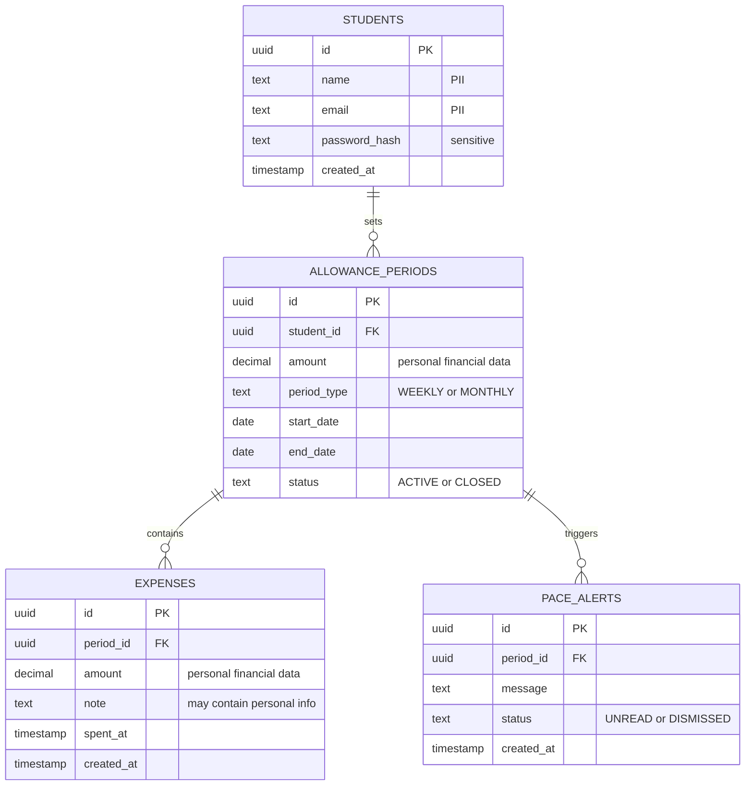

# Entity-Relationship Diagram (Draft) for the Budget Tracker

## Key

| Symbol | Meaning |
|---|---|
| `\|\|` | Exactly one |
| `o{` | Zero or more |
| PK / FK | Primary key / foreign key |
| "PII" and similar comments | Personal or sensitive data to protect |

## Notes

- **Audience / risk:** developers and whoever protects the data; it reduces the risk of a wrong schema and of leaking personal data.
- Derived from `class.md`: one table per stored class. The three enumerations are stored as text columns with the same values.
- The 1-to-many multiplicities in the class diagram become the foreign keys `student_id` and `period_id`.
- Remaining balance is not stored; it is calculated from `amount` and the expenses.
- The ERD uses snake_case and the class diagram uses camelCase. This is a naming convention, not a mismatch.
- Draft: finalized with the database schema later.
