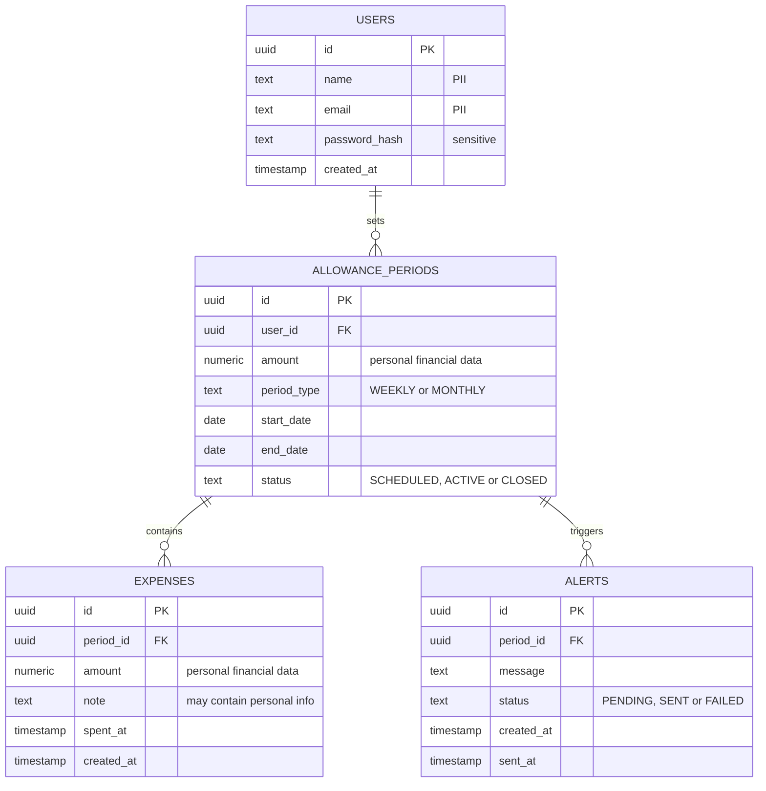

# Entity-Relationship Diagram (Draft) for the Budget Tracker

## Key

| Symbol | Meaning |
|---|---|
| `\|\|` | Exactly one |
| `o{` | Zero or more |
| PK / FK | Primary key / foreign key |
| "PII" and similar comments | Personal or sensitive data to protect |

## Notes

- Derived from `class.md`: one table per stored class. The three enumerations are stored as text columns with the same values.
- The 1-to-many multiplicities in the class diagram become the foreign keys `user_id` and `period_id`.
- Draft: finalized with the database schema in Week 9.
