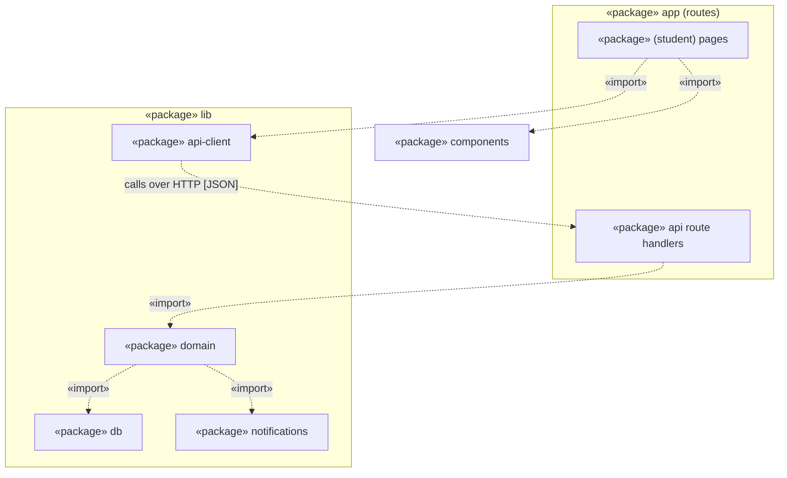

# UML Package Diagram for the Budget Tracker Project

## Key

| Notation | Meaning |
|---|---|
| «package» box | A folder or module |
| Frame around boxes | A parent package containing sub-packages |
| Dashed arrow «import» | The source package uses the target package |

## Layering rule

Pages never import `lib/db` or `lib/notifications`; only `lib/domain` does, and pages reach the server only through `lib/api-client` and the API route handlers.

## Notes

- This matches the container diagram: the web pages call the API over HTTP and do not touch the database.
- Components map to folders: Expense Service, Pace Calculator and Auth Guard live in `lib/domain`; Budget Repository in `lib/db`; Notification Adapter in `lib/notifications`.
