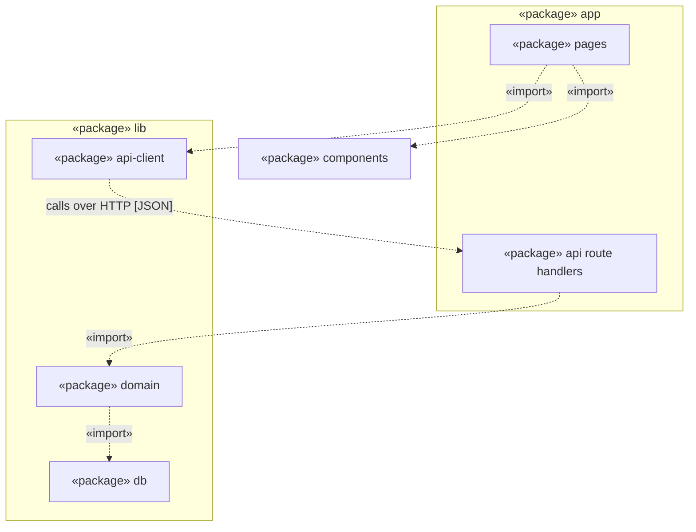

# UML Package Diagram for the Budget Tracker Project

**Layering rule:** pages never import `lib/db`; only `lib/domain` does, and pages reach the server only through `lib/api-client` and the API route handlers.

## Key

| Notation | Meaning |
|---|---|
| «package» box | A folder or module |
| Frame around boxes | A parent package containing sub-packages |
| Dashed arrow «import» | The source package uses the target package |

## Notes

- **Audience / risk:** developers; it reduces the risk of tangled code and of pages touching the database.
- This matches `containers.md`: the Web Application calls the API Application over HTTP and does not touch the database.
- `lib/domain` holds the Expense Service, Allowance Service, Pace Calculator and Auth Guard from `components.md`. `lib/db` holds the Budget Repository.
