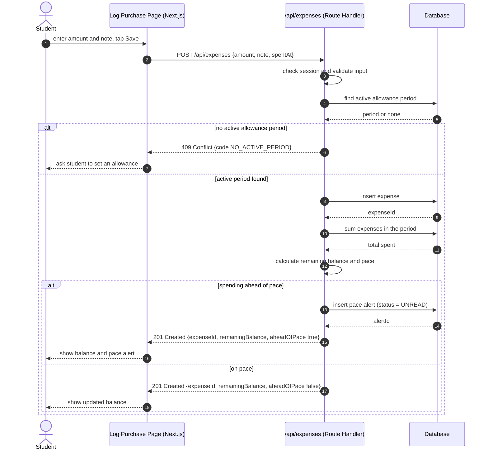

# UML Sequence Diagram for the Budget Tracker: Log a Purchase

## Key

| Notation | Meaning |
|---|---|
| Solid arrow | A call; the caller waits for the reply |
| Dashed arrow | A reply |
| alt / else box | Alternative paths, each with a condition |

## Notes

- **Audience / risk:** developers and testers; it reduces the risk of a slow or broken logging flow. This flow is the riskiest because the whole Lean Canvas depends on logging in under 5 seconds (our riskiest assumption, #2).
- It also changes data (a status-bearing PaceAlert is created) and depends on a signed-in student.
- There are no asynchronous messages and no external systems: the alert is returned in the same response and shown in the app.
- The only web-to-API message is `POST /api/expenses`, which must match the API contract.
- Not drawn: 400 (invalid input) and 401 (not signed in) responses.
