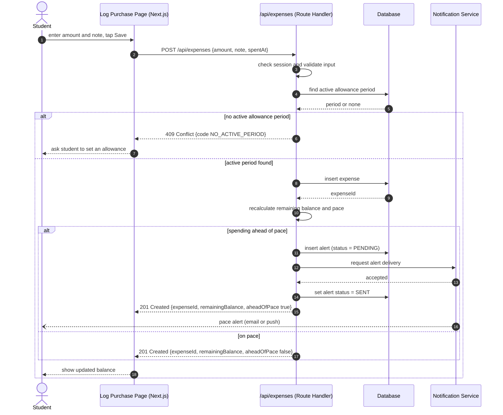

# UML Sequence Diagram for the Budget Tracker: Log a Purchase

## Key

| Notation | Meaning |
|---|---|
| Solid arrow | Synchronous call (the caller waits) |
| Dashed arrow | Reply |
| Open-arrowhead arrow (`--)`) | Asynchronous message (alert delivered later) |
| alt / else box | Alternative paths, each with a guard |

## Notes

- This is the riskiest flow: it touches login, money-like data, an external system and a pace rule, and it is tied to the 5-second logging goal.
- The student's alert arrives asynchronously, after the API has already replied.
- The only web-to-API message is `POST /api/expenses`, which must appear in the API contract.
- Not drawn: 400 (invalid input) and 401 (not logged in) responses.
