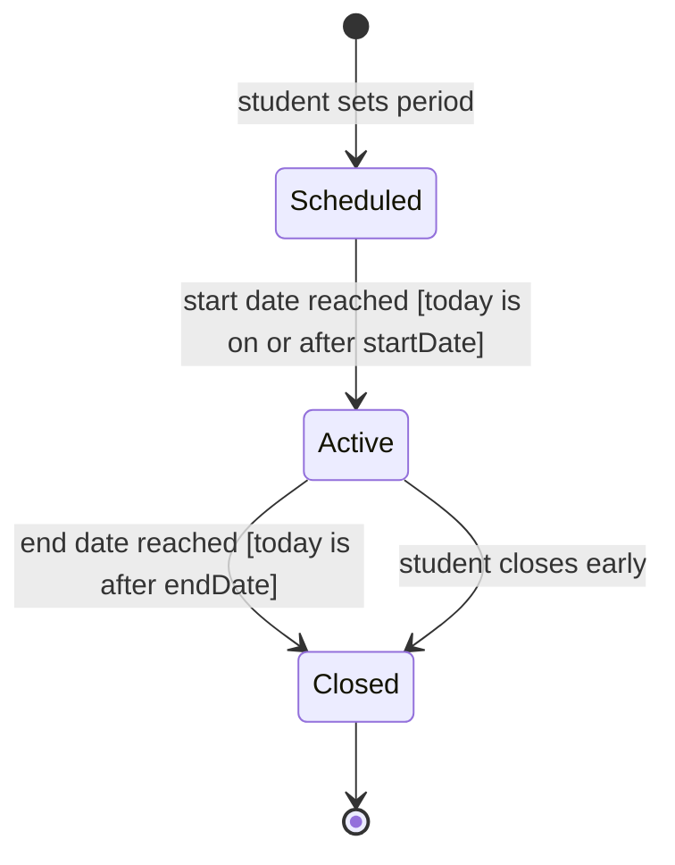

# UML State Machine Diagram for an AllowancePeriod

## Notes

- States are conditions that last: Scheduled, Active, Closed. They match the `PeriodStatus` enumeration (SCHEDULED, ACTIVE, CLOSED) in `class.md` and the `status` column in `erd.md`.
- Purchases can be logged only while the period is Active. Otherwise the API returns `409 Conflict` (NO_ACTIVE_PERIOD), as shown in `sequence.md`.
- The API must reject any status change not drawn here, for example Closed back to Active.
- Expenses have no lifecycle, so the AllowancePeriod is the main entity with a status.
