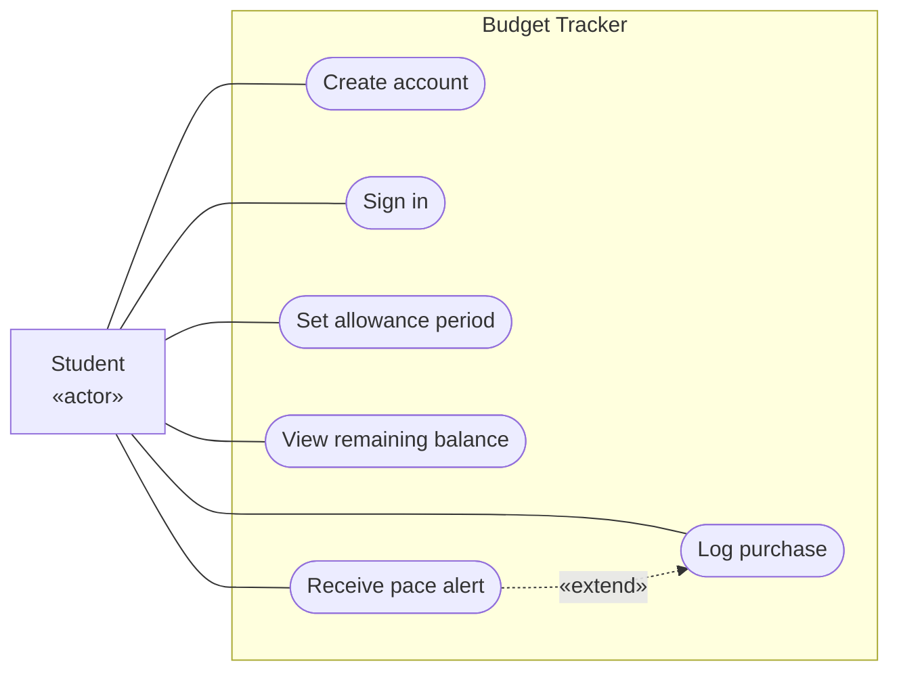

# UML Use Case Diagram for the Budget Tracker

## From MVP feature to use case

| MVP feature (Lean Canvas / Javelin board) | Use case |
|---|---|
| Weekly or monthly allowance period | Set allowance period |
| Quick logging of small purchases in under 5 seconds | Log purchase |
| Real-time remaining balance | View remaining balance |
| Gentle alert when spending is ahead of pace | Receive pace alert |
| Each student's data is personal (team assumption) | Create account, Sign in |

## Key

| Notation | Meaning |
|---|---|
| «actor» box | A user role from `context.md` |
| Oval | A goal-level use case, named verb + object |
| Frame | The system boundary |
| Solid line | The actor takes part in the use case |
| Dashed arrow «extend» | Optional behaviour added to another use case (the alert happens only when spending is ahead of pace) |

## Notes

- **Audience / risk:** the whole team and the instructor; it reduces the risk of missing or inventing features.
- The only actor is the Student, the only actor in `context.md`.
- **Team assumption to confirm:** the sources do not mention accounts. We assume email and password sign-in so each student's data stays private.
- Not in the MVP: bank linking, categories, paid tier, history export.
