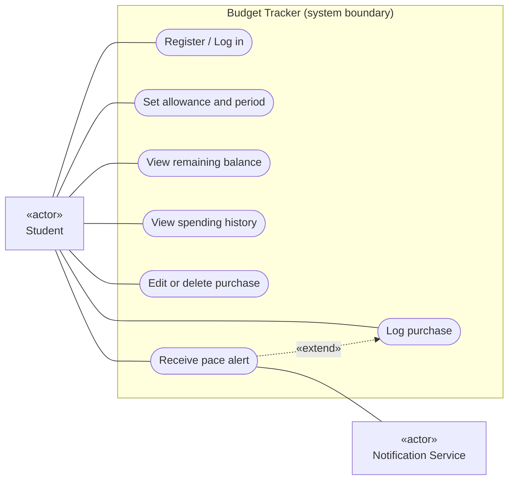

# UML Use Case Diagram for the Budget Tracker MVP

## Key

| Notation | Meaning |
|---|---|
| «actor» box | A role or external system outside the Budget Tracker |
| Oval | A goal the actor achieves (verb + object) |
| Large frame | System boundary: what is inside the Budget Tracker |
| Solid line | The actor takes part in that use case |
| Dashed arrow «extend» | Optional behaviour added to the base use case under a condition |

## Notes

- Mermaid has no dedicated use case diagram type, so this flowchart approximates UML notation.
- "Receive pace alert" extends "Log purchase" because the alert happens only when spending is ahead of pace.
- Actors match the context diagram: Student and Notification Service.
- Not in this MVP: export history and upgrade to premium (paid tier).

## Use cases and MVP features

| Use case | MVP feature it comes from |
|---|---|
| Register / Log in | Accounts for students |
| Set allowance and period | Weekly or monthly allowance setup |
| Log purchase | Quick logging in under 5 seconds |
| View remaining balance | Real-time remaining balance |
| View spending history | Review past purchases |
| Edit or delete purchase | Correct logging mistakes |
| Receive pace alert | Gentle alert when spending is ahead of pace |
